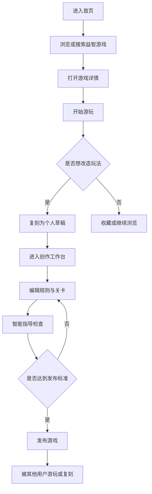

# 益智小游戏平台产品需求文档

## 1. 产品概述
益智小游戏平台面向喜欢轻量脑力挑战、想快速创作玩法的用户，提供“玩游戏、复刻游戏、创造并发布游戏、智能指导创作”的一体化体验。
- 主要解决用户找不到高质量轻量益智游戏、非技术用户难以表达和发布玩法、优秀玩法难以被复刻再创作的问题。
- 产品价值在于形成“游玩获得灵感 - 复刻改编 - 智能指导创作 - 发布传播 - 再被复刻”的内容循环。

## 2. 核心功能

### 2.1 用户角色
| 角色 | 注册方式 | 核心权限 |
|------|----------|----------|
| 游客 | 无需注册 | 浏览精选游戏、试玩公开游戏、查看游戏详情 |
| 注册用户 | 邮箱注册或第三方登录 | 收藏、复刻、创建、保存草稿、发布游戏、查看个人作品 |
| 创作者 | 注册用户自然成长 | 管理已发布游戏、查看复刻来源、维护作品版本 |
| 管理员 | 后台分配 | 审核违规游戏、精选推荐、处理举报 |

### 2.2 功能模块
1. **首页与发现**：展示精选益智游戏、热门标签、新发布作品、创作入口。
2. **游戏游玩页**：运行小游戏、显示规则、记录进度、支持收藏和复刻。
3. **游戏详情页**：展示玩法说明、作者、标签、版本、复刻关系、评论与数据。
4. **创作工作台**：通过表单、规则配置和实时预览创建游戏。
5. **智能指导面板**：根据用户输入的玩法目标，提供规则拆解、难度建议、文案建议和发布检查。
6. **复刻流程**：复制公开游戏为个人草稿，保留来源关系，允许修改规则、外观与关卡。
7. **个人中心**：管理草稿、已发布游戏、收藏、复刻记录。

### 2.3 页面详情
| 页面名称 | 模块名称 | 功能描述 |
|----------|----------|----------|
| 首页 | 顶部导航 | 搜索游戏、进入创作、登录状态展示 |
| 首页 | 精选舞台 | 用大卡片展示主推游戏，突出“立即开玩”和“复刻改造” |
| 首页 | 游戏瀑布流 | 按标签、难度、热度展示公开游戏 |
| 游戏游玩页 | 游戏运行区 | 根据游戏配置渲染可交互益智小游戏 |
| 游戏游玩页 | 规则侧栏 | 展示目标、操作方式、步数、得分、重开按钮 |
| 游戏详情页 | 作品信息 | 作者、发布时间、标签、难度、版本、复刻来源 |
| 创作工作台 | 玩法设定 | 设置游戏名称、目标、规则、难度、标签 |
| 创作工作台 | 关卡编辑 | 配置棋盘、谜题参数、提示文案和胜利条件 |
| 创作工作台 | 实时预览 | 边配置边试玩，发现规则冲突 |
| 创作工作台 | 智能指导 | 给出创作建议、可玩性检查和发布前优化 |
| 复刻流程 | 复刻确认 | 显示原作品来源，创建可编辑副本 |
| 个人中心 | 作品管理 | 查看草稿、发布作品、收藏、复刻作品 |

## 3. 核心流程
用户从首页发现游戏并试玩；若喜欢某个玩法，可收藏或一键复刻为自己的草稿；在创作工作台中修改规则、关卡与视觉风格；智能指导会持续检查玩法完整性、难度曲线和发布文案；用户确认后发布，其他用户继续游玩或复刻。

## 4. 用户界面设计

### 4.1 设计风格
- **整体方向**：玩具实验室风格，像一个装满脑力机关的桌面工作台，强调创作感和可玩性。
- **主色**：深墨蓝 `#0B1020`，用于背景和沉浸式游玩氛围。
- **辅助色**：奶油白 `#F7F0DC`、木质橙 `#D97732`、荧光青 `#3EF3D8`、棋子红 `#FF5C6C`。
- **按钮风格**：厚重圆角、轻微 3D 压感、悬停时有位移和阴影变化。
- **字体建议**：标题使用有游戏感的几何显示字体，正文使用清晰但有温度的衬线或圆体。
- **布局风格**：桌面卡片、棋盘网格、侧边工具抽屉、可拖拽积木式配置区域。
- **动效方向**：页面加载时卡片错落入场，按钮点击有弹性回馈，复刻时使用“复制棋子”动画隐喻。

### 4.2 页面设计概览
| 页面名称 | 模块名称 | UI 元素 |
|----------|----------|---------|
| 首页 | 精选舞台 | 大尺寸游戏卡、斜向标签、游戏缩略棋盘、强对比行动按钮 |
| 首页 | 游戏瀑布流 | 不规则卡片网格、难度徽章、复刻次数、作者头像 |
| 游戏游玩页 | 游戏运行区 | 中央棋盘或谜题面板、沉浸背景、状态条 |
| 游戏游玩页 | 规则侧栏 | 纸张质感面板、目标列表、提示按钮、复刻入口 |
| 创作工作台 | 编辑区 | 左侧规则表单、中间实时预览、右侧智能指导 |
| 创作工作台 | 智能指导 | 对话式建议卡、风险提示、发布检查清单 |
| 个人中心 | 作品管理 | 标签筛选、草稿状态、发布状态、版本关系 |

### 4.3 响应式
- 采用桌面优先设计，优先保证创作工作台在大屏上的效率。
- 平板端将编辑面板折叠为抽屉，保留预览优先。
- 手机端优先支持浏览、游玩、收藏和简单复刻；复杂创作建议跳转到桌面端继续。

## 5. 首个版本范围
- 提供账号登录、公开游戏浏览、游戏详情、基础游玩、收藏、复刻、创作草稿、发布功能。
- 首批内置 3 类可配置益智模板：滑块拼图、数字合成、路径连接。
- 智能指导先实现为“规则检查 + 模板化建议 + 可扩展 AI 接口预留”，后续可接入更强的生成式能力。
- 管理后台不进入首版，只保留数据库字段和简单审核状态。
