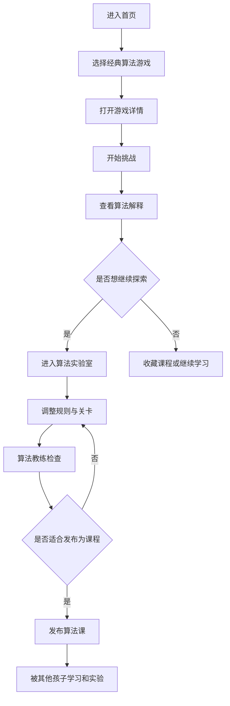

# 小学生算法启蒙游戏平台产品需求文档

## 1. 产品概述
脑力小工坊面向小学生、家长和老师，提供“玩经典脑力游戏、理解背后算法、完成分级挑战、进入算法实验室改造关卡”的寓教于乐体验。
- 主要解决算法启蒙抽象、枯燥、离孩子生活远的问题，用迷宫、汉诺塔、数独等经典游戏建立算法直觉。
- 产品价值在于形成“玩游戏 - 看复盘 - 懂算法 - 做挑战 - 改规则 - 创造新关卡”的学习闭环。

## 2. 核心功能

### 2.1 用户角色
| 角色 | 注册方式 | 核心权限 |
|------|----------|----------|
| 学生 | 无需注册或家长创建 | 游玩算法游戏、查看动画复盘、收藏课程、进入实验室 |
| 家长/老师 | 邮箱注册或第三方登录 | 查看学习进度、管理收藏课程、保存算法实验 |
| 课程创作者 | 后台分配 | 维护经典算法游戏、设计分级挑战、发布课程 |
| 管理员 | 后台分配 | 管理课程内容、精选推荐、处理反馈 |

### 2.2 功能模块
1. **算法游戏库**：展示迷宫 BFS、汉诺塔递归、数独回溯等经典算法游戏。
2. **游戏挑战页**：运行小游戏、显示任务、记录步数、引导孩子观察策略。
3. **算法详情页**：展示游戏规则、算法概念、适合年级、训练能力和学习说明。
4. **算法实验室**：允许调整规则、目标和关卡，观察算法思想如何迁移。
5. **算法教练面板**：检查课程目标、算法解释、挑战难度和孩子是否容易理解。
6. **学习档案**：管理收藏课程、算法实验、学习进度和已掌握算法。
7. **家长/老师入口**：后续接入账号、班级、学习记录和云同步。

### 2.3 页面详情
| 页面名称 | 模块名称 | 功能描述 |
|----------|----------|----------|
| 首页 | 顶部导航 | 进入算法课、算法实验室、学习档案 |
| 首页 | 今日算法课 | 用大卡片展示主推经典游戏和背后算法 |
| 首页 | 算法游戏库 | 按算法、年级、训练能力展示课程 |
| 游戏游玩页 | 游戏运行区 | 根据游戏配置渲染可交互益智小游戏 |
| 游戏游玩页 | 学习侧栏 | 展示任务、算法提示、重开和进入实验室 |
| 游戏详情页 | 算法说明 | 算法名称、孩子能理解的一句话、适合年级、能力标签 |
| 算法实验室 | 课程设定 | 设置实验名称、算法主题、挑战目标、难度 |
| 算法实验室 | 实时预览 | 边调整边试玩，观察规则变化 |
| 算法实验室 | 算法教练 | 检查课程解释和挑战难度 |
| 学习档案 | 进度管理 | 查看算法实验、收藏课程和掌握算法 |

## 3. 核心流程
孩子从首页选择一节经典算法游戏课；先直接挑战，再在详情页理解背后的算法；若想进一步探索，可进入算法实验室修改规则和关卡；算法教练帮助检查课程解释是否清晰；家长或老师在学习档案中查看收藏课程和算法掌握情况。

## 4. 用户界面设计

### 4.1 设计风格
- **整体方向**：算法游乐场风格，像一个装满脑力机关的学习实验室，强调探索、复盘和顿悟感。
- **主色**：深墨蓝 `#0B1020`，用于背景和沉浸式游玩氛围。
- **辅助色**：奶油白 `#F7F0DC`、木质橙 `#D97732`、荧光青 `#3EF3D8`、棋子红 `#FF5C6C`。
- **按钮风格**：厚重圆角、轻微 3D 压感、悬停时有位移和阴影变化。
- **字体建议**：标题使用有游戏感的几何显示字体，正文使用清晰但有温度的衬线或圆体。
- **布局风格**：课程卡片、棋盘网格、算法提示侧栏、实验参数面板。
- **动效方向**：页面加载时卡片错落入场，按钮点击有弹性回馈，算法复盘强调“搜索扩散”和“退回重试”。

### 4.2 页面设计概览
| 页面名称 | 模块名称 | UI 元素 |
|----------|----------|---------|
| 首页 | 今日算法课 | 大尺寸课程卡、算法标签、游戏缩略棋盘、强对比行动按钮 |
| 首页 | 算法游戏库 | 不规则卡片网格、年级标签、能力标签、算法说明 |
| 游戏游玩页 | 游戏运行区 | 中央棋盘或谜题面板、沉浸背景、状态条 |
| 游戏游玩页 | 学习侧栏 | 纸张质感面板、算法提示、目标列表、实验入口 |
| 算法实验室 | 编辑区 | 左侧课程表单、中间实时预览、右侧算法教练 |
| 算法实验室 | 算法教练 | 对话式建议卡、解释清晰度、难度检查清单 |
| 学习档案 | 进度管理 | 收藏课程、算法实验、掌握算法统计 |

### 4.3 响应式
- 采用桌面优先设计，优先保证算法实验室在大屏上的效率。
- 平板端将编辑面板折叠为抽屉，保留预览优先。
- 手机端优先支持浏览、挑战、收藏和查看算法解释；复杂实验建议跳转到桌面端继续。

## 5. 首个版本范围
- 提供算法游戏浏览、游戏详情、基础挑战、收藏、算法实验、学习档案功能。
- 首批内置 3 节经典算法课：迷宫最短路 BFS、汉诺塔递归、数独回溯。
- 算法教练先实现为“课程解释检查 + 难度检查 + 可扩展 AI 接口预留”，后续可接入更强的个性化讲解能力。
- 管理后台不进入首版，只保留家长/老师入口和 Supabase 扩展预留。
