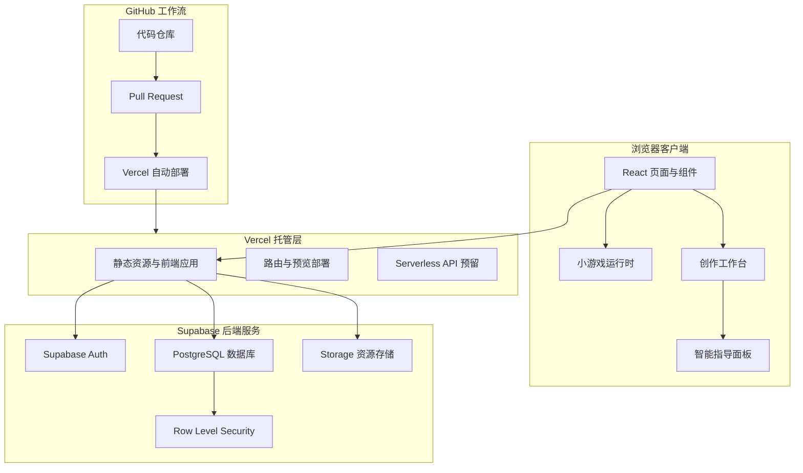
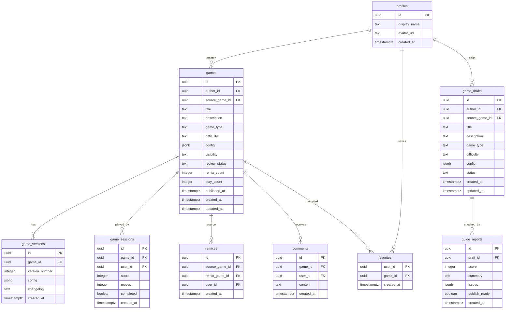

# 益智小游戏平台技术架构文档

## 1. 架构设计



## 2. 技术说明
- **前端**：React 18 + TypeScript + Vite。
- **样式**：Tailwind CSS 3 + CSS 变量，支持自定义玩具实验室视觉系统。
- **路由**：React Router，覆盖首页、游戏详情、游玩页、创作工作台、个人中心、登录页。
- **状态管理**：优先使用 React Context 和自定义 Hooks；复杂编辑状态使用 Zustand。
- **游戏运行时**：前端配置驱动渲染，首版支持滑块拼图、数字合成、路径连接三类模板。
- **后端服务**：Supabase Auth + Supabase PostgreSQL + Supabase Storage。
- **部署**：GitHub 托管代码，Vercel 连接 GitHub 自动预览和生产部署。
- **初始化工具**：Vite。
- **智能指导首版**：前端规则检查 + Supabase 保存建议记录；保留 `/api/guide` Serverless API 扩展点，后续可接入 AI 模型。

## 3. 路由定义
| 路由 | 用途 |
|------|------|
| `/` | 首页与游戏发现 |
| `/games/:gameId` | 游戏详情页 |
| `/play/:gameId` | 游戏游玩页 |
| `/create` | 新建游戏工作台 |
| `/create/:draftId` | 编辑已有草稿 |
| `/remix/:gameId` | 复刻公开游戏并生成草稿 |
| `/me` | 个人中心与作品管理 |
| `/auth` | 登录与注册 |

## 4. API 定义
首版优先通过 Supabase 客户端直接访问数据库，并用 RLS 控制权限。Vercel Serverless API 仅保留智能指导扩展点。

```typescript
export type GuideRequest = {
  draftId?: string
  gameType: 'sliding_puzzle' | 'number_merge' | 'path_connect'
  title: string
  goal: string
  rules: Record<string, unknown>
  difficulty: 'easy' | 'medium' | 'hard'
}

export type GuideIssue = {
  level: 'info' | 'warning' | 'error'
  title: string
  description: string
  suggestion: string
}

export type GuideResponse = {
  score: number
  summary: string
  issues: GuideIssue[]
  publishReady: boolean
}
```

## 5. 数据模型

### 5.1 数据模型定义



### 5.2 数据定义语言

```sql
create extension if not exists "pgcrypto";

create table profiles (
  id uuid primary key references auth.users(id) on delete cascade,
  display_name text not null default '未命名玩家',
  avatar_url text,
  created_at timestamptz not null default now()
);

create table games (
  id uuid primary key default gen_random_uuid(),
  author_id uuid not null references profiles(id) on delete cascade,
  source_game_id uuid references games(id) on delete set null,
  title text not null,
  description text not null default '',
  game_type text not null check (game_type in ('sliding_puzzle', 'number_merge', 'path_connect')),
  difficulty text not null check (difficulty in ('easy', 'medium', 'hard')),
  config jsonb not null default '{}'::jsonb,
  visibility text not null default 'public' check (visibility in ('public', 'unlisted', 'private')),
  review_status text not null default 'approved' check (review_status in ('pending', 'approved', 'rejected')),
  remix_count integer not null default 0,
  play_count integer not null default 0,
  published_at timestamptz,
  created_at timestamptz not null default now(),
  updated_at timestamptz not null default now()
);

create table game_versions (
  id uuid primary key default gen_random_uuid(),
  game_id uuid not null references games(id) on delete cascade,
  version_number integer not null,
  config jsonb not null,
  changelog text not null default '',
  created_at timestamptz not null default now(),
  unique (game_id, version_number)
);

create table game_drafts (
  id uuid primary key default gen_random_uuid(),
  author_id uuid not null references profiles(id) on delete cascade,
  source_game_id uuid references games(id) on delete set null,
  title text not null default '未命名游戏',
  description text not null default '',
  game_type text not null check (game_type in ('sliding_puzzle', 'number_merge', 'path_connect')),
  difficulty text not null default 'easy' check (difficulty in ('easy', 'medium', 'hard')),
  config jsonb not null default '{}'::jsonb,
  status text not null default 'draft' check (status in ('draft', 'published', 'archived')),
  created_at timestamptz not null default now(),
  updated_at timestamptz not null default now()
);

create table guide_reports (
  id uuid primary key default gen_random_uuid(),
  draft_id uuid not null references game_drafts(id) on delete cascade,
  score integer not null check (score between 0 and 100),
  summary text not null,
  issues jsonb not null default '[]'::jsonb,
  publish_ready boolean not null default false,
  created_at timestamptz not null default now()
);

create table favorites (
  user_id uuid not null references profiles(id) on delete cascade,
  game_id uuid not null references games(id) on delete cascade,
  created_at timestamptz not null default now(),
  primary key (user_id, game_id)
);

create table game_sessions (
  id uuid primary key default gen_random_uuid(),
  game_id uuid not null references games(id) on delete cascade,
  user_id uuid references profiles(id) on delete set null,
  score integer not null default 0,
  moves integer not null default 0,
  completed boolean not null default false,
  created_at timestamptz not null default now()
);

create table comments (
  id uuid primary key default gen_random_uuid(),
  game_id uuid not null references games(id) on delete cascade,
  user_id uuid not null references profiles(id) on delete cascade,
  content text not null,
  created_at timestamptz not null default now()
);

create table remixes (
  id uuid primary key default gen_random_uuid(),
  source_game_id uuid not null references games(id) on delete cascade,
  remix_game_id uuid references games(id) on delete set null,
  user_id uuid not null references profiles(id) on delete cascade,
  created_at timestamptz not null default now()
);

alter table profiles enable row level security;
alter table games enable row level security;
alter table game_versions enable row level security;
alter table game_drafts enable row level security;
alter table guide_reports enable row level security;
alter table favorites enable row level security;
alter table game_sessions enable row level security;
alter table comments enable row level security;
alter table remixes enable row level security;

create policy "公开游戏可读" on games for select using (visibility = 'public' and review_status = 'approved');
create policy "作者管理自己的游戏" on games for all using (auth.uid() = author_id) with check (auth.uid() = author_id);
create policy "用户管理自己的资料" on profiles for all using (auth.uid() = id) with check (auth.uid() = id);
create policy "用户管理自己的草稿" on game_drafts for all using (auth.uid() = author_id) with check (auth.uid() = author_id);
create policy "用户读取自己的指导报告" on guide_reports for select using (
  exists (
    select 1 from game_drafts
    where game_drafts.id = guide_reports.draft_id
      and game_drafts.author_id = auth.uid()
  )
);
create policy "用户管理自己的收藏" on favorites for all using (auth.uid() = user_id) with check (auth.uid() = user_id);
create policy "公开评论可读" on comments for select using (true);
create policy "用户管理自己的评论" on comments for all using (auth.uid() = user_id) with check (auth.uid() = user_id);
```

## 6. 开发与部署流程
- 在 GitHub 创建仓库，主分支连接 Vercel 生产环境。
- 每个功能分支通过 Pull Request 触发 Vercel Preview Deployment。
- Supabase 项目分别配置本地、预览、生产环境变量。
- 前端通过 `VITE_SUPABASE_URL` 和 `VITE_SUPABASE_ANON_KEY` 连接 Supabase。
- 数据库迁移脚本后续建议放在 `supabase/migrations` 目录，由 Supabase CLI 管理。

## 7. 环境变量
| 变量名 | 用途 | 暴露范围 |
|--------|------|----------|
| `VITE_SUPABASE_URL` | Supabase 项目地址 | 前端可见 |
| `VITE_SUPABASE_ANON_KEY` | Supabase 匿名公钥 | 前端可见 |
| `SUPABASE_SERVICE_ROLE_KEY` | 后续服务端管理密钥 | 仅 Vercel Serverless 环境 |
| `GUIDE_MODEL_API_KEY` | 后续 AI 智能指导模型密钥 | 仅 Vercel Serverless 环境 |

## 8. 首版实现策略
- 先用本地 Mock 数据完成首页、详情页、游玩页和创作体验，保证产品可演示。
- 再接入 Supabase Auth 与数据库，实现真实账号、草稿、发布、复刻、收藏。
- 智能指导先采用确定性规则引擎，避免首版依赖未确定的 AI 服务。
- 保留清晰的数据模型和 API 边界，使后续扩展生成式指导、多人协作和内容审核更容易。
